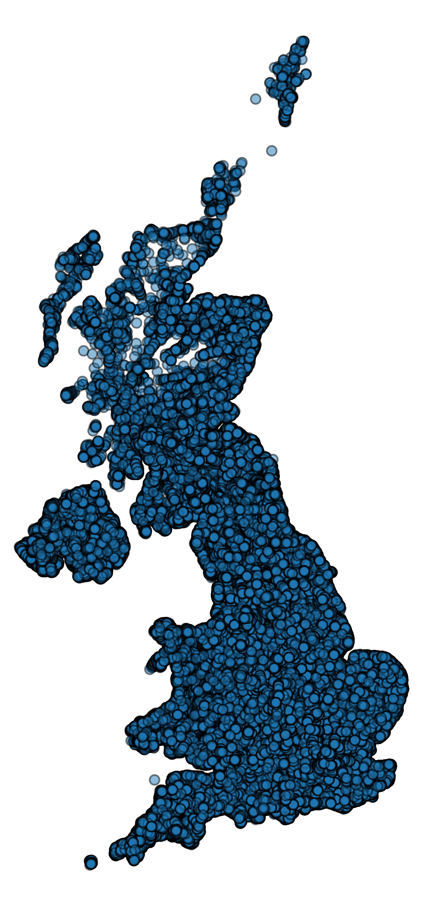
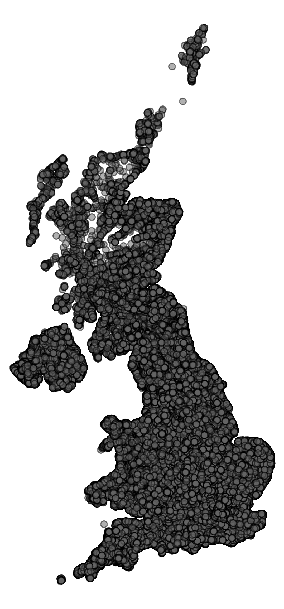
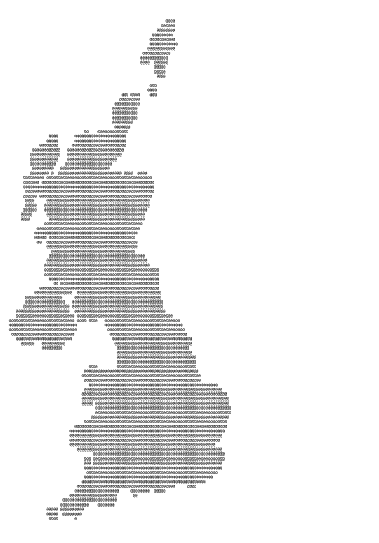

# ASCII MAP GENERATOR

## Approach:
The Overall Approach is based on the following steps:

Data --> Mercator Projection + Inverting --> Generating Plot Image + Grayscale Conversion --> Image to Ascii Conversion

### Data
The data contained the postal code and lattitude and longitude coordinates of each postal code:

While looking at the data csv, some descripencies were found, where the values of the lattitude exceeded the actual range of (-90,90), hence these rows were eliminated.

Initially, to have a look at the data, I made a scatter plot of the data with latitude as y coordinate and longitude as the x coordinate.

As seen in the above image, the plot does not bear any resemblance to the UK map.

### Mercator Projection

Therefore inorder to adjust the coordinates, we need to project them onto a 2D surface. I used the mercater projection to convert the latitudes and longitudes to x,y coordinates for plotting.
Ref: https://en.wikipedia.org/wiki/Mercator_projection
Ref: https://stackoverflow.com/questions/14329691/convert-latitude-longitude-point-to-a-pixels-x-y-on-mercator-projection

Post applying the mercator projection and flipping the image to have higher latitudes in the start:

Caveat: Aspect Ratios, have been manually fixed, dynamic calculation based on the range of latitudes did not yeild good results.
In the above plot, all the axis were dropped from the plot, to facilitate image generation of this plot.

### Image Generation and Grayscale Conversion
The axis are removed and the plot is saved to an image, this essentially allows to dicretize the plot to integer x,y coordinates(pixel locations), which would ennable us to place the ascii text for generation.

The Grayscale image:

### Image to ASCII conversion
Resize the imge to account for the character size(the value is empiracal, found this was needed, when comparing my results with the ones generated from online tools).
Then After thresholding the Grayscale values based on the number of different characters we would like to use, we can loop over the image and write the ASCII art string.

Result:

